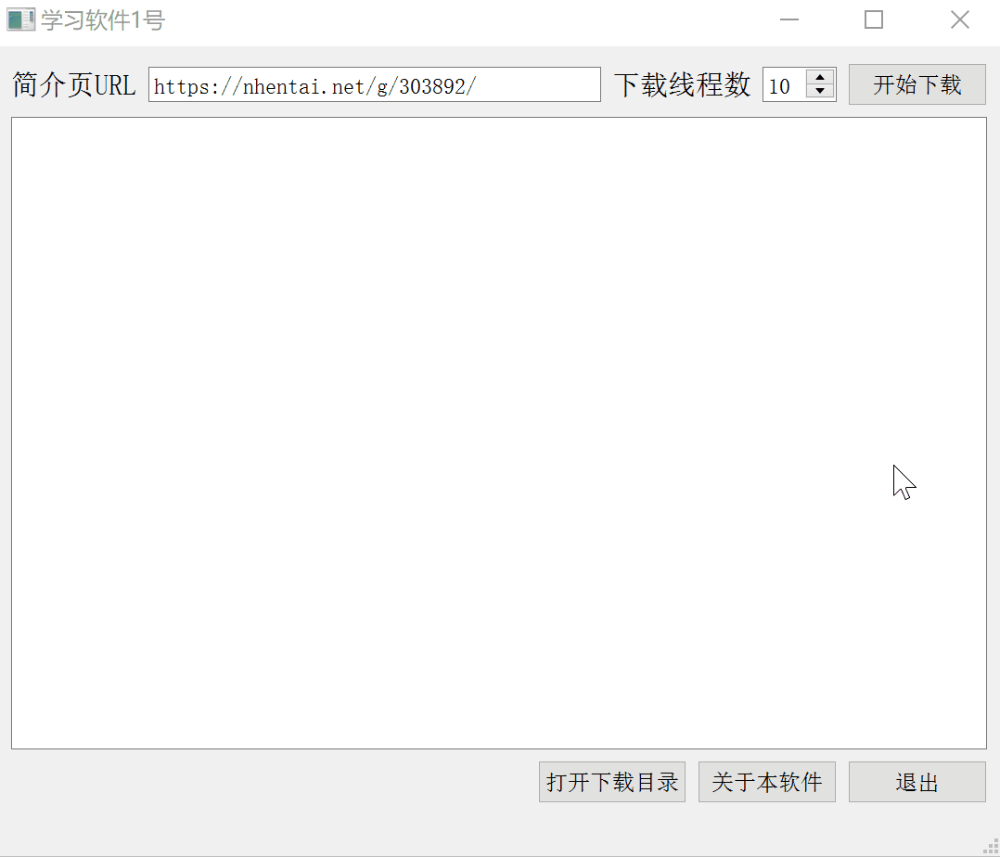
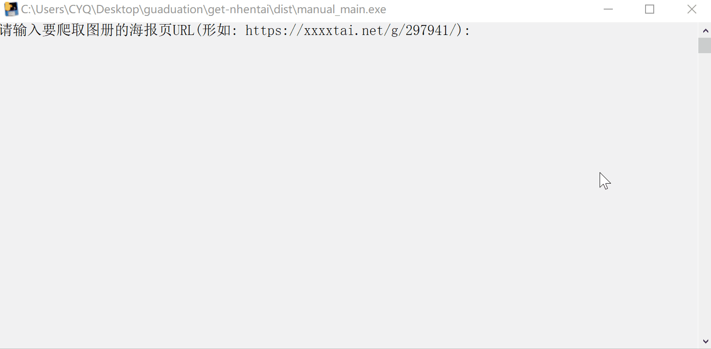
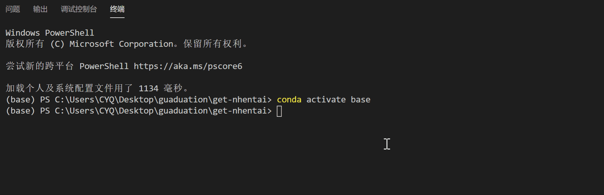
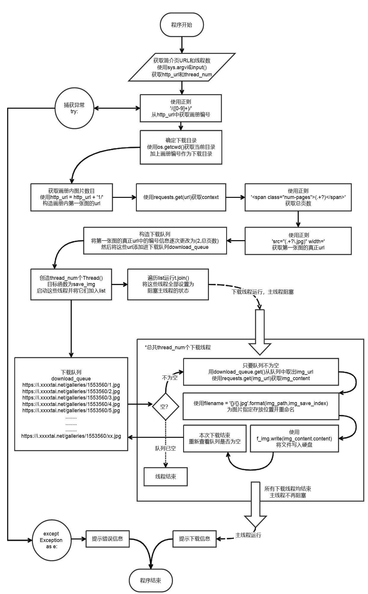
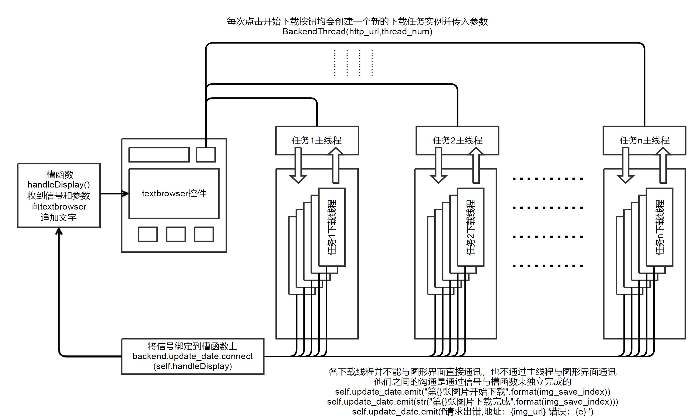

# :rocket: 使用PyQt5图形界面的Python多线程nhentai爬虫

**Python** **PyQt5** **界面与逻辑分离** **信号与槽函数** **多线程**  **Queue消息队列**  **爬虫** **pyinstaller**

:warning: 本程序仅供交流学习只用，请勿用于其他用途

- [可执行文件下载页面](https://github.com/chenyuqin-dlut/nhentai-imgcollect/releases)
- [为什么要写这个程序](#3-为什么要写这个程序)
  
# 0. 基本信息

> * Python 3.7.4
> * PyQt5 (控制台版本不需要)

本软件是用于批量下载 :arrow_down: 漫画网站 `nhentai` 画册的 `python` 爬虫 :spider: 程序，带有图形界面（也提供不带图形界面的小体积版本），支持自定义多线程功能，使用 `pyinstaller` 进行了打包 :inbox_tray: ，可以在未安装 `python` 的电脑上运行

# 1. 运行演示
## 1.1. 图形界面单任务多线程下载


上图为使用 20 线程下载一个有 20 张图的图册，可以看到，速度极快 :zap: ，只要你的设备网络带宽够大 :globe_with_meridians: ，性能够强，你看的速度就赶不上下的速度 :satisfied:

## 1.2. 图形界面多任务多线程下载

没错，这个小玩意儿程序不光支持单任务多线程下载 :airplane: ，还支持多任务多线程下载 :rocket: ，你可以在上一个任务还未结束之时就启动下一个任务，这也是将图形界面与业务逻辑进行分离带来的好处之一



这次，只要你复制粘贴的速度够快，下载的速度就追不上你 :stuck_out_tongue_winking_eye:

## 1.3. 控制台版本

以下两个版本均支持单任务多线程，但不支持多任务

### 1.3.1. 运行时获取信息

对于 `manual_main.py` 及由其打包出来的独立程序 `manual_mail.exe` 在运行程序之后会提示输入画册简介页URL和使用线程数



### 1.3.2. 命令行直接传参

对于 `main.py` ，使用如下命令格式进行下载：

```shell
python main.py 简介页url 线程数
```

如：

```shell
python main.py https://xxxxtai.net/g/297941/ 5
```



:warning: 请务必用完整、准确的简介页url指导下载工作


# 2. 程序框架

## 2.1. 单任务多线程的实现



如图所示，使用了 `python` 自带的 `Thread` 来创建下载线程并阻塞主线程，使用了 `Queue` 来填充任务队列，每个下载线程自行从任务队列中取出下载链接，当队列为空且本次下载已完成时，下载线程结束，当每一个下载线程均结束时，主线程不再阻塞，提示下载信息并等待用户输入回车结束程序

## 2.2. 多任务多线程的实现



🤫 千万别说这是 `8051` 通过 `74138` 片选存储器示意图:smiling_imp:

如图所示，在主界面点下下载按钮时，将会创建一个下载任务的实例并为它传入参数，这个任务的主线程将会根据传入的参数创建下载线程，每一个下载线程均能独立的发送信号，并通过绑定在信号上的槽函数 `handleDisplay` 向界面中的显示控件 `textBrowser` 追加文字

途中没有画出主线程发送信号的线，但实际上下载完成的信息是由主线程发送的信号来触发槽函数显示的

# 3. 为什么要写这个程序

我有一个群友。。。。。这回是真的！

:punch: :older_man: :facepunch:  以下截图均经高度无损**脱敏**处理，不用担心隐私问题


本来 :older_man: 只是看到群里面有这样头铁的兄弟，准备来搞笑一下的，没想到这位兄弟头真的有点铁

还真的给 :older_man: 发了瑟图网站


看到这位兄弟学编程的 :heart: 这么诚，:older_man: :sob: :hot_pepper: ，当场许下诺言！10w个工作日内写完

老话说得好，宁拆⑩座庙，不毁一颗学手艺的心，正好举国防疫期间在家无聊，昨天写了写爬虫，今天写了写界面，就传到GitHub上来了